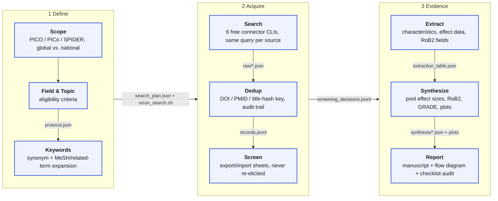

# prisma-review

*A PRISMA 2020-conformant systematic review and meta-analysis pipeline that actually runs, built on [Claude Code](https://claude.com/claude-code).*

> Note: This is an independent open-source project and is not affiliated with, endorsed by, or sponsored by Anthropic. Anthropic and Claude Code are referenced only to describe the toolchain this workflow uses.

Most "AI systematic review" tools are reporting assistants: you search, screen, and extract data elsewhere (Rayyan, RevMan, Excel), then interview a model into narrating what you already did. This repo instead runs the whole pipeline — real database search, real deduplication, a real screening workflow, real data extraction, and real statistical meta-analysis (pooled effect sizes, heterogeneity, forest/funnel plots, GRADE certainty) — as an **AI-assisted PRISMA-oriented review harness**, not an autonomous reviewer: protocol decisions, screening/eligibility judgments, full-text retrieval, extraction supervision, and every final methodological call stay with you, while search execution, deduplication, record-keeping, and the mechanical parts of synthesis (pooling arithmetic, heterogeneity stats, plot generation) are automated and auditable.

## What this is — and is not

This project helps a reviewer build an auditable evidence map and review workspace, with real search/dedup/synthesis machinery underneath. It is **not** a substitute for protocol registration (PROSPERO or equivalent), independent dual screening, licensed database access, full-text access, or your own expert methodological judgment — and it is not yet field-agnostic: the shipped risk-of-bias tools (RoB2, Newcastle-Ottawa), question frameworks (PICO/PICo/SPIDER/PIRD), and the default PRISMA 2020 manuscript structure all assume a clinical/health-science review. Four of the six search connectors are genuinely multidisciplinary, but the methodology skills downstream of search are not — a computer-science, engineering, or humanities systematic review is not yet well served here.

## Pipeline



Every edge above is a `results/<TOPIC>/` file, not a conversation the reviewer has to re-have. Nothing downstream is ever re-elicited from memory — the report drafts straight from what the pipeline actually recorded.

## Quickstart

```bash
claude
# Then inside Claude Code:
/prisma-init "your review topic"      # scope, PICO, eligibility criteria, keyword expansion
/prisma-search                        # run connectors against enabled sources, dedupe
/prisma-screen export                 # write a title/abstract screening sheet to disk
# ... edit results/<TOPIC>/screening/title_abstract_sheet.csv (or .md) by hand ...
/prisma-screen import                 # append your decisions to the ledger
/prisma-extract                       # build the extraction table (characteristics, effect data, RoB2)
/prisma-synthesize                    # pool poolable outcomes, plot, assess heterogeneity/GRADE
/prisma-report                        # draft the manuscript, flow diagram, and checklist audit
```

`/prisma-status "your review topic"` works at any point and reconstructs exactly where a review stands, since every stage's state is either append-only or fully re-derivable — close your laptop mid-screening for weeks and pick back up with nothing lost.

- [User guide](USER_GUIDE.md) — installation, first review, recovery, troubleshooting
- [Contributing](CONTRIBUTING.md) — what belongs upstream and the PR bar
- [Security policy](SECURITY.md) — reporting and untrusted-content boundaries
- [Agent/runtime notes](AGENTS.md) — non-Claude connector discovery

## Honest limitations

- **Rate limits and coverage gaps are real.** Semantic Scholar's unauthenticated pool rate-limits often; PubMed/Europe PMC skew biomedical; a topic outside all six sources' combined coverage will search incompletely, and the pipeline reports this rather than hiding it — it does not yet block on it (see `USER_GUIDE.md`'s "Incomplete or interrupted review" section).
- **Full-text access is on you.** The framework fetches what's freely available and otherwise asks you to supply the text; it does not bypass paywalls or institutional access controls.
- **Extraction and risk-of-bias judgments are a single AI-assisted pass, not independent dual review.** Treat every extracted value and RoB/GRADE judgment as a draft for your review, not a finished second-rater.
- **The default workflow is Claude Code-native.** Non-Claude agent runtimes get discoverable connector CLIs (see `AGENTS.md`) but not the slash-command orchestration layer described above.

## Free, multi-disciplinary sources

Six connectors ship out of the box, chosen to cover most disciplines with no paid access required:

| Source | Coverage |
|---|---|
| **OpenAlex** | Broad multi-disciplinary index, generous free API |
| **Crossref** | DOI registry metadata, near-universal publisher coverage |
| **Semantic Scholar** | CS/multi-disciplinary, citation graph |
| **PubMed** | Biomedical/life sciences, MeSH-indexed |
| **Europe PMC** | Biomedical + preprints + patents, broader than PubMed |
| **arXiv** | STEM preprints (flagged as not-yet-peer-reviewed in extraction) |

A seventh connector, citation chasing (backward/forward snowballing via OpenAlex), covers PRISMA's "other methods" identification stream — see `/prisma-search --chase-citations`.

Need an institutional source (Scopus, Web of Science)? Run `/prisma-add-source` — it scaffolds a new connector against the same fixed `{meta, results}` JSON contract the connectors above already use, with credentials read only from an environment variable, never a flag or a tracked file.

## Fork this and adapt

**This repo is a universal template.** The connectors, PRISMA methodology, screening workflow, and synthesis math are topic-agnostic and reviewer-agnostic — fork it, run `/prisma-init "your topic"`, and everything your specific review produces lands under `results/<your-topic>/`, which is gitignored by default. Upstream improvements to the pipeline (new connectors, dedup fixes, better pooling logic) stay mergeable back into your fork precisely because your review's own data was never committed to it in the first place. See [CONTRIBUTING.md](CONTRIBUTING.md) for what's universal-pipeline vs. instance-specific, and [AGENTS.md](AGENTS.md) if you're driving this from a non-Claude agent runtime.

## Repo structure

```
prisma-review/
├── CLAUDE.md               # persona, workflow pointer
├── CLAUDE.local.md.example # reviewer-profile template (copy to CLAUDE.local.md, gitignored)
├── AGENTS.md               # thin pointer for non-Claude runtimes
├── .claude/
│   ├── commands/           # the 9 slash commands
│   └── skills/             # PRISMA methodology, eligibility gates, synthesis stats
├── .agents/skills/         # cross-runtime connector pointers (Codex/Antigravity discoverable)
├── connectors/             # one Python package: 7 source connectors + shared HTTP/retry/contract code
├── synthesis/              # pooling, heterogeneity, forest/funnel/RoB-traffic-light plots
├── results/<TOPIC>/        # per-review state (gitignored except structure + schema docs)
├── tools/                  # CI/maintainer scripts (lint, contract checks) + runtime path-safety
│                           #   (path_policy.py, export_report.py — see SECURITY.md)
├── tests/                  # fixture-based, no live network
└── requirements.txt        # requests, statsmodels, matplotlib
```

## Requirements

- [Claude Code](https://claude.com/claude-code)
- Python 3.10+ (`pip install -r requirements.txt`)
- Optional: [Pandoc](https://pandoc.org/) for `--export docx|pdf` on the manuscript; the pipeline is Markdown-first and works fully without it.

## License

MIT for all framework code and prompts, with an explicit carve-out for two CC BY 4.0 reference documents and one file adapted from another MIT project with attribution preserved — see [LICENSE](LICENSE) for the exact terms.
